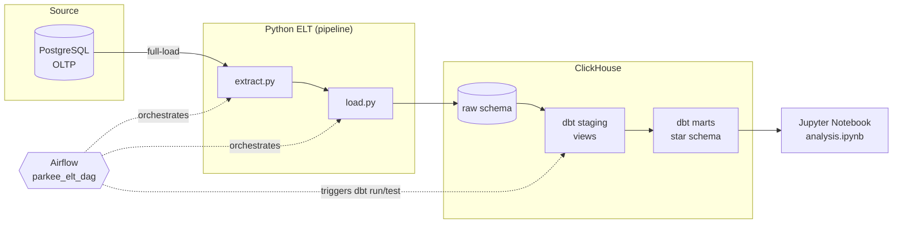

# Parkee POS - Data Engineering Technical Test (Beginner)

## 1. Deskripsi Project & Skenario Bisnis

Pipeline data end-to-end untuk skenario **Sistem Kasir Minimarket (POS)**,
single tenant. Data transaksi kasir (customers, products, transactions,
transaction_items) di-extract dari PostgreSQL (OLTP), di-load penuh
(full-load) ke ClickHouse sebagai data warehouse, ditransformasi dengan dbt
menjadi star schema, lalu dianalisis di Jupyter Notebook untuk menjawab 3
pertanyaan bisnis:

1. 5 produk terlaris per kategori
2. Trend revenue bulanan
3. Persentase penggunaan tiap metode pembayaran

Lihat [`docs/erd.md`](docs/erd.md) untuk ERD OLTP dan star schema lengkap.

## 2. Arsitektur



Orkestrasi: satu DAG Airflow (`parkee_elt_dag`), task berurutan
`extract_load_python -> dbt_run -> dbt_test`, `max_active_runs=1` supaya run
tidak overlap (full-load truncate+insert tidak aman dijalankan konkuren).

## 3. Tech Stack

| Komponen | Tools |
|---|---|
| Source DB | PostgreSQL 15 |
| Pipeline | Python 3.10+, `psycopg2`, `clickhouse-connect` |
| Transformasi | dbt Core + `dbt-clickhouse` |
| Orkestrasi | Apache Airflow 2.8 (LocalExecutor) |
| Data Warehouse | ClickHouse |
| Visualisasi | Jupyter Notebook (`pandas`, `matplotlib`, `seaborn`) |
| Containerisasi | Docker & Docker Compose |

## 4. Setup dari Nol

### Prasyarat
- Docker & Docker Compose
- Python 3.9+/3.10+ (untuk jalankan seed script / notebook di luar Docker, opsional)

### Langkah

```bash
# 1. Clone & masuk ke folder project
git clone <repo-url>
cd parkee-de-test-beginner

# 2. Siapkan .env
cp .env.example .env
# (nilai default sudah jalan tanpa diubah untuk local dev)

# 3. Jalankan seluruh stack
docker compose up -d --build

# Tunggu semua service healthy:
docker compose ps

# 4. Populate data dummy ke Postgres (OLTP)
bash seed/run_seed.sh

# 5. Buka Airflow UI (http://localhost:8080, login admin/admin),
#    unpause DAG "parkee_elt_dag", lalu trigger manual (▶) untuk
#    menjalankan extract -> load -> dbt run -> dbt test.
#
#    Atau trigger via CLI:
docker exec parkee_airflow_scheduler airflow dags unpause parkee_elt_dag
docker exec parkee_airflow_scheduler airflow dags trigger parkee_elt_dag

# 6. Buka notebook analisis
cd notebook
python3 -m venv .venv && source .venv/bin/activate
pip install -r requirements.txt
CLICKHOUSE_HOST=localhost jupyter notebook analysis.ipynb
```

### Menjalankan dbt secara manual (di luar Airflow)

`.env` menyetel `CLICKHOUSE_HOST=clickhouse` (nama service Docker) supaya
container Airflow bisa resolve host tersebut lewat Docker network. Kalau
mau jalankan dbt langsung dari host machine (bukan dari dalam container),
override ke `localhost`:

```bash
cd dbt
python3 -m venv .venv && source .venv/bin/activate
pip install dbt-clickhouse
CLICKHOUSE_HOST=localhost dbt run
CLICKHOUSE_HOST=localhost dbt test
```

## 5. Struktur Repo

```
parkee-de-test-beginner/
├── README.md
├── docker-compose.yml
├── .env.example
├── seed/                 # DDL + seed data dummy ke Postgres
├── pipeline/             # Python EL: extract -> load (full-load)
├── dbt/
│   └── models/
│       ├── staging/      # 1:1 dari raw, clean & rename
│       └── marts/        # star schema: dim_customer, dim_product, dim_date, fact_sales
├── airflow/
│   ├── Dockerfile
│   └── dags/parkee_elt_dag.py
├── notebook/
│   └── analysis.ipynb    # Q1-Q3 + visualisasi
└── docs/
    └── erd.md             # ERD OLTP + star schema
```

## 6. Pertanyaan Analitik & Visualisasi

| Pertanyaan | Tipe Chart |
|---|---|
| Q1 — 5 produk terlaris per kategori (total quantity) | Bar chart horizontal, grouped per kategori |
| Q2 — Trend revenue bulanan | Line chart dengan sumbu waktu |
| Q3 — Persentase metode pembayaran | Donut chart |

Semua query & chart ada di `notebook/analysis.ipynb`, jalan langsung dari
mart layer (`analytics_marts.fact_sales`, `dim_product`) di ClickHouse.

## 7. Video Walkthrough

_ Link Video --> https://drive.google.com/file/d/1X9A1JkaixvSJHwFwwqPqsqiEJyNI2gl3/view?usp=sharing

## 8. Catatan Pendekatan

- Filter `status = 'completed'` diterapkan di **staging** (`stg_transactions`),
  bukan di fact, supaya semua model turunan otomatis konsisten memakai
  definisi "transaksi valid" yang sama tanpa perlu re-apply rule di
  masing-masing mart.
- `dim_date` di-generate dari rentang `min`/`max` `transaction_date` di
  `stg_transactions` (tidak ada tabel kalender di source OLTP).
- DAG Airflow diset `max_active_runs=1` setelah ditemukan race condition:
  dua run yang overlap (misalnya saat unpause DAG yang otomatis memicu
  catch-up run bersamaan dengan trigger manual) bisa saling menimpa siklus
  `TRUNCATE + INSERT` di `load.py` dan menghasilkan data dobel di raw layer.
- ClickHouse 24.3 tidak mendukung `formatDateTime` dengan specifier `%B`/`%A`
  (nama bulan/hari penuh) — dipakai `dateName()` sebagai gantinya di
  `dim_date.sql`.
