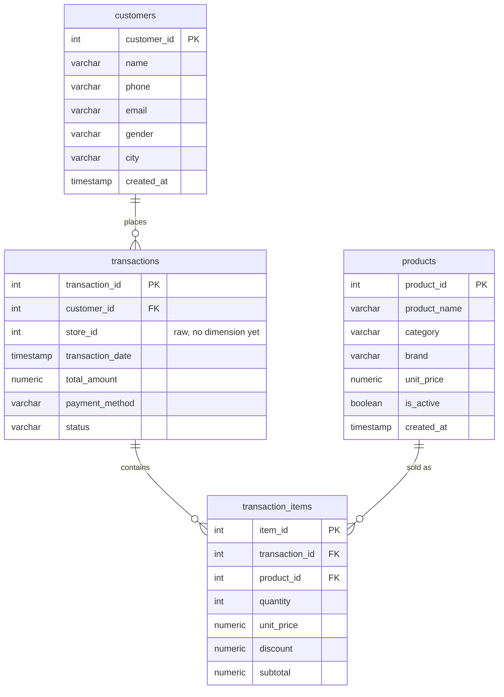
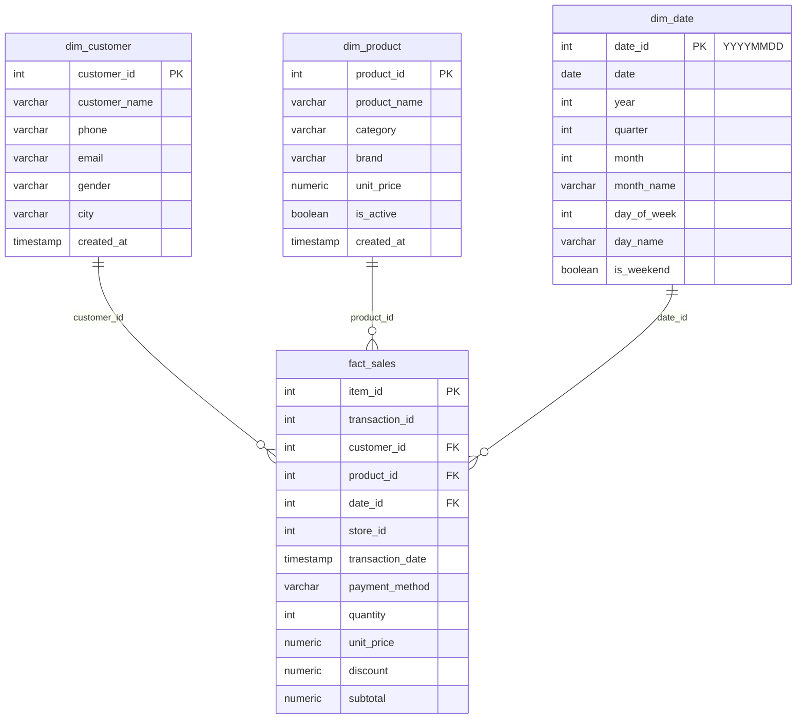

# ERD — Parkee POS (Sistem Kasir Minimarket)

## 1. OLTP Source (PostgreSQL, `raw` operational schema)

Single tenant, 4 tabel. `store_id` di `transactions` masih kolom mentah (angka 1-3),
belum ada tabel `stores` di level Beginner ini.

## 2. Star Schema (dbt mart, ClickHouse `analytics_marts`)

`fact_sales` berada di grain **satu baris per transaction item**. Filter
`status = 'completed'` sudah diterapkan sejak `stg_transactions` (staging),
supaya semua mart di atasnya otomatis konsisten tanpa perlu re-apply rule ini.

## 3. Catatan Desain

- **Kenapa filter `status = 'completed'` di staging, bukan di fact?**
  Supaya semua mart (dan analisis ad-hoc di atas staging) otomatis konsisten
  memakai definisi "transaksi valid" yang sama, tanpa risiko lupa re-apply
  filter di tiap model turunan.
- **Kenapa `dim_date` di-generate, bukan diambil dari source?** Tidak ada
  tabel kalender di OLTP; date spine dibangun dari rentang
  `min(transaction_date)` s.d. `max(transaction_date)` di `stg_transactions`.
- **`store_id`** sengaja tetap kolom mentah di `fact_sales` (bukan FK ke
  dimensi toko) karena level Beginner belum mewajibkan `dim_store` — itu
  scope Intermediate.
